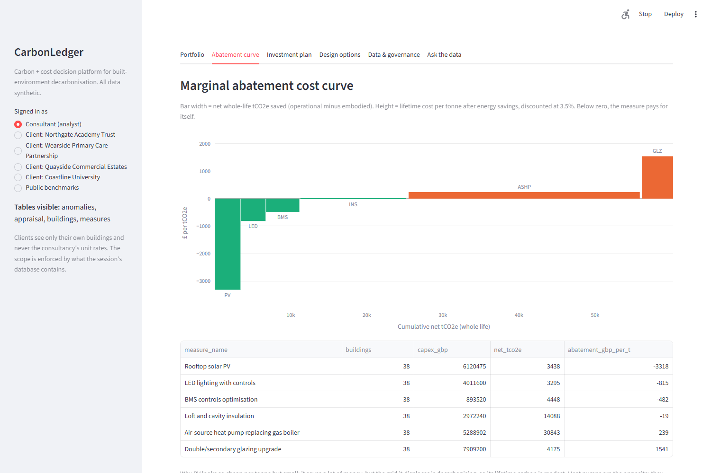

# CarbonLedger

**A carbon + cost decision platform for built-environment decarbonisation.**

CarbonLedger puts carbon and cost data into one central place and turns it into decisions a client can act on: which retrofit measures to fund, in which buildings, in what order, and what a lower-carbon design option really costs per tonne saved. Consultancy staff, client organisations and the public each see a different, enforced slice of the same data.

> Portfolio demo built by [Waqas Ahmad](https://www.linkedin.com/in/waqas-ahmad09/). **All data is synthetic** (four fictional clients, 40 buildings), and the factors are illustrative values in published ranges. It is not client work and not a certified carbon assessment.



## What it does

| Layer | What it does | Module |
|---|---|---|
| **1. Ingestion & data quality** | Validates client meter and floor-area data, quarantines bad records with a reason rather than silently fixing them, and records lineage plus the reference-data version for each run | `warehouse.py` |
| **2. Central warehouse** | DuckDB holding buildings, appraisals, measures, anomalies, provenance and lineage | `warehouse.py` |
| **3. Carbon-cost appraisal** | Six retrofit measures applied **fabric first**, so interactions are captured (insulation shrinks the heat pump, a heat pump adds electrical load). Whole-life carbon = operational savings on a decarbonising grid minus embodied (A1-A5). NPV at the Green Book 3.5%, lifetime £/tCO2e, payback, and a PSDS/Salix-style grant screen | `appraisal.py` |
| **4. Portfolio optimiser** | Exact MILP (multiple-choice knapsack, HiGHS): one package per building, maximising net whole-life tCO2e within a capital budget, with optional grant-only and NPV ≥ 0 constraints | `optimise.py` |
| **5. Design-option embodied carbon** | Element bill of quantities → RICS WLCA modules A1-A3, A4, A5, C1-C4, cost per m², and **£ per tonne avoided**, so a design choice can be compared like for like with retrofit abatement | `embodied.py` |
| **6. Analytics** | Peer benchmarking with a robust (median/MAD) z-score on log energy intensity flags metering faults and waste for a person to review | `analytics.py` |
| **7. AI analyst** | Claude with two tools, guarded SQL and the optimiser, answering plain-English questions inside the user's data scope. Runs in an offline template mode without an API key | `assistant.py` |
| **8. Governance & security** | Role-scoped sessions, a read-only SQL guard, PII redaction and an append-only audit log | `governance.py` |

## Results on the synthetic estate

The estate has 38 buildings that pass validation (two are quarantined), 129,920 m², 6,366 tCO2e a year and £5.66m a year of energy spend.

**Abatement curve (net whole-life tCO2e, lifetime £/tCO2e):**

| Measure | Net tCO2e | £/tCO2e | Reading |
|---|---:|---:|---|
| Rooftop PV | 3,438 | −3,318 | Pays back strongly, but displaces a grid that is getting cleaner, so the carbon is modest |
| LED lighting | 3,295 | −815 | |
| BMS optimisation | 4,448 | −482 | Cheapest tonnes in heat-led buildings |
| Insulation | 14,088 | −19 | Roughly cost-neutral; makes the heat pump smaller |
| Air-source heat pump | 30,843 | +239 | **Raises running cost** at 2026 gas and electricity prices, yet it is half the carbon prize |
| Glazing | 4,175 | +1,541 | Expensive per tonne |

**Optimised investment plans:**

| Budget | Capex | Net whole-life tCO2e | Portfolio NPV | Buildings |
|---:|---:|---:|---:|---:|
| £1m | £1.00m | 5,113 | +£2.11m | 19 |
| £3m | £3.00m | 11,869 | +£4.62m | 30 |
| £6m | £6.00m | 20,610 | +£3.80m | 35 |

Beyond about £3m the plan buys deeper tonnes (heat pumps) at the expense of NPV. That trade-off is the kind of evidence a client's investment committee needs to see.

**Design options for a 1,200 m² extension (frame, floors, substructure and roof only):**

| Option | Upfront kgCO2e/m² | Cost £/m² |
|---|---:|---:|
| A. Steel frame + composite deck | 172 | 200 |
| B. RC frame, 50% GGBS | 193 | 150 |
| C. Glulam + CLT hybrid | 147 | 310 |

Timber cuts upfront carbon by 15% but costs about £4,350 per tonne avoided, more than ten times the cost of a heat-pump tonne in the existing estate. Putting both on the same £/tCO2e scale is the point of the platform.

## Governance model

| Role | Can see | Cannot see |
|---|---|---|
| Consultant (analyst) | Everything, including unit rates, quarantine, provenance, lineage and the audit log | |
| Client | Its own buildings, appraisals and anomalies; cost totals | Other clients, unit rates, fixed costs, quarantine |
| Public | Anonymised benchmarks by building type | Anything client-identifiable |

Scope is enforced by **what the session's database contains**. `scoped_connection()` builds an in-memory DuckDB with only that role's tables and columns, detaches the warehouse and disables external file access. The AI assistant only ever receives that connection, so no prompt can reach data outside it. LLM-written SQL also passes `guard_sql` (one read-only SELECT, allowlisted tables, no file functions, row cap), questions are redacted for emails and phone numbers, and every query, block and plan is audited.

## Run it

```bash
pip install -r requirements.txt
python -m carbonledger.pipeline        # build the warehouse, write docs/results.json
python -m pytest -q                    # 34 tests
streamlit run app.py                   # dashboard; set ANTHROPIC_API_KEY for the live assistant
```

## Tests (34)

The tests cover validation and quarantine; net carbon equal to operational minus embodied; the fabric-first heat-pump sizing; heat pumps that raise cost but cut carbon; grid decarbonisation shrinking PV carbon; the abatement-cost sign matching NPV; cumulative packages; MACC ordering; optimiser budget, monotonicity, beating a greedy baseline, and the grant and NPV constraints; embodied module arithmetic; detection of the planted anomalies with a quiet detector on clean data; client isolation, hidden unit rates, blocked re-attach of the warehouse and public scope; SQL-guard attacks; redaction; and the offline assistant's scope and auditing.

## Limitations and what a real deployment needs

- **Factors and rates are illustrative.** A live system would load DESNZ conversion factors and Green Book long-run grid factors, EPDs or ICE for materials, and the consultancy's own cost database (the proprietary layer this platform is designed to protect).
- **The appraisal is a steady-state annual model.** It does not simulate hourly behaviour. Heat-pump sizing, PV self-consumption and lighting heat gains are simplified, and refrigerant leakage (B1) is not yet counted.
- **Measures are applied in a fixed fabric-first order**, so the optimiser chooses depth per building, not arbitrary subsets.
- **For production:** Postgres with row-level security in place of per-session DuckDB, SSO, data-processing agreements per client, and versioned factor libraries, so an appraisal can always be reproduced.

MIT licence.
